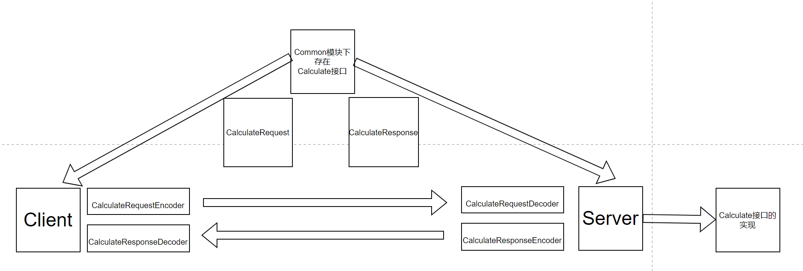

什么是RPC ?
Remote Procedure Call 远程过程调用
远程客户端可直接调用服务端方法（像调用本地方法一样）
前提：服务端与客户端需要有相同的方法参数存根。服务端与客户端可以进行通信

为什么需要RPC ?
目前基本都是微服务，微服务对很大型的项目模块进行拆解。拆解后这就涉及到各个子模块的相互调用
为了提高代码复用

为什么需要学RPC ?
因为是学java的...

跟着大佬写一个简单的RPC
# Commit 1 
基于Netty的服务端
基于Netty的客户端
# Commit 2
尝试使用远程调用方法
实现远程调用计算接口Calculate的实现
